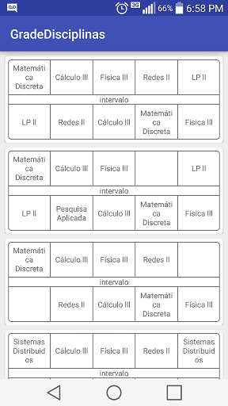

# Grafo de cores

## Grade de Disciplinas
Trabalho com intuito de representar o grafo de cores em um aplicativo

### O Aplicativo
No Aplicativo, o usuário cadastra disciplinas a serem cursadas, informa os horários e manda gerar as grades. O aplicativo monta todas grades possíveis trata os conflitos e exibe em ordem de maior carga horária.

#### Cadastro de disciplina

#### Lista de disciplinas

#### Menu gerar grade

#### Lista de grades

